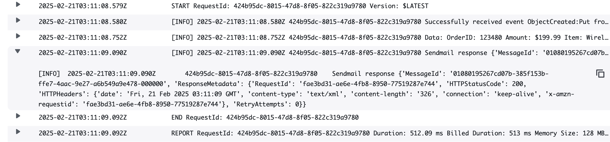

# Quick Start for AWS Lambda and SES
A quick start for Lambda function interacting with SES email service using Terraform configuration for provisioning and configuration management. It consists of a `lambda` module creating Lambda function resource [handle_s3_notifications](./functions/handle_s3_notifications.py) and mangages security and ACL access to S3 buckets and SES service through IAM policies. S3 notification will be configured and trigger the Lambda function when new objects created. The function then processes and send out email with the details of the receipts.

## Pre-requisites

* Terraform binary - If you currently don't have Terraform installed on your machine, this [guide](https://developer.hashicorp.com/terraform/install) will show you how to install the executable.
* AWS account - AWS credential is required for AWS provider. Without modification to any part of the configuration, you may choose to use AWS profile or Environment Variable method, listed in this [guide](https://registry.terraform.io/providers/hashicorp/aws/latest/docs#authentication-and-configuration), otherwise the provider configuratoin can be modified to suit the need with any supported method.
* Previously completed [quick-start-aws-lambda-and-s3-with-terraform](https://github.com/daily-ops/quick-start-aws-lambda-and-s3-with-terraform). This guide consumes the outputs from the previous Quick Start.
* [AWS email addresses identity verification](https://docs.aws.amazon.com/ses/latest/dg/creating-identities.html) for the From and To addresses.

## Preparation

The following variables are required where they can be supplied through `terraform.tfvars` or `TF_VAR_<variable>`, then proceed to `init`, `plan`, and `apply` respectively.


|Variables|Description|
|-|-|
|aws_region|The selected AWS region to provision the resource|
|s3_bucket_id|ID of the S3 bucket to store Lambda function|
|s3_data_bucket_arn|ARN of the S3 bucket containing the data to set up the notification|
|s3_data_bucket_id|ID of the S3 bucket containing the data to set up the notification|
|from_address|From email address for the notification email|
|to_address|To email address for the notification email|
|email_to_identiy_arn|ARN of the To email address from SES IAM policy|
|email_from_identiy_arn|ARN of the From email address from SES IAM policy|

## Test

- Navigate to the directory containing the previous quick start guide [quick-start-aws-lambda-and-s3-with-terraform](https://github.com/daily-ops/quick-start-aws-lambda-and-s3-with-terraform).
  
- Create a sample data file by running the command below at terminal prompt with new `Order_id`.
  
    ```
    cat >data.json<<-EOF
    {
        "Order_id": "12345",
        "Amount": 199.99,
        "Item": "Wireless Headphones"
    }
    EOF
    ```

- Using `curl` command to ***POST*** data to the endpoint.

    ```
    curl -X POST -H "Content-Type: application/json" --data @data.json "$(terraform output -raw base_url)/upload"
    ```

    

- Checking CloudWatch log by logging in to AWS console and navigate to CloudWatch and expand the ***Logs*** from the menus. There will be Log Groups created for Lambda and API Gateway to find log message of each transaction.

    

## References

- https://docs.aws.amazon.com/ses/latest/dg/creating-identities.html
- https://docs.aws.amazon.com/AmazonS3/latest/userguide/notification-content-structure.html